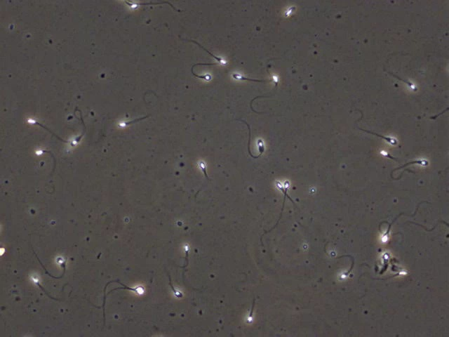
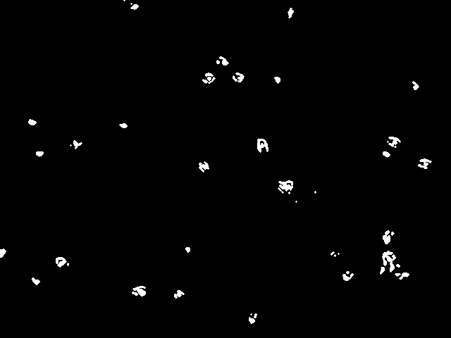
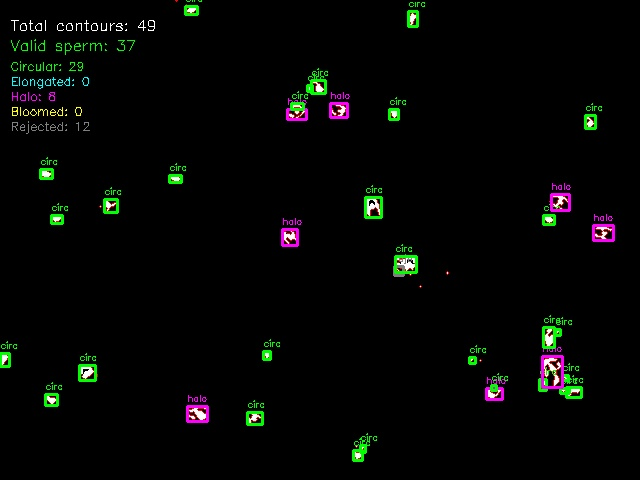

# Sperm Motility Analysis
Implemention of an automated sperm motility analysis using OpenCV to detect, track, and classify sperm movement in microscopy videos.

## 🚀 Quick Start

```bash
# Clone repository
git clone https://github.com/Sai-Priyanka/Aaas-SpermTracker-Test.git
cd Aaas-SpermTracker-Test

# Install dependencies
pip install -r requirements.txt

# Run analysis
python SpermTracker.py
```

**Input**: Sperm motility video (`.mp4`)  
**Output**: CSV data + 2 annotated videos with trajectories

## Workflow
```
Video I/P → Preprocessing → Detection → Tracking → Classification → Outputs
     │             │            │          │            │           │
640×480@49fps  Threshold+  4 Patterns Centroid  Adaptive   CSV + Videos     
               Top-hat     Recognition Tracking  Thresholds 

Sperm Patterns:          Movement Types:           Output Files:
- Circular               • Fast (Green)            • CSV Report
- Oval                   • Slow (Yellow)           • Dots Video  
- Double-headed          • Immotile (Red)          • Bbox Video
- Halo-effect
```

##  Video Analysis

### Initial Assessment
Our implementation began with comprehensive video analysis to select the optimal computer vision approach:

| **Video Characteristic** | **Observation** | **Strategies** |
|-------------------------|-----------------|----------------------|
| **Resolution** | 640×480 @ 49 FPS | Optimized parameters for this scale |
| **Background** | Very static, minimal movement | Perfect for background subtraction |
| **Contrast** | High contrast sperm vs background | Ideal for thresholding techniques |
| **Sperm Appearance** | Bright glowing heads, darker tails | Head-focused detection strategy |
| **Noise** | Dark particles and debris | Robust filtering required |
| **Movement** | Linear, erratic, and static patterns | Multi-class classification needed |
| **Overlap** | Very rare (<5%) | Simple centroid tracking sufficient |

### Selected approach: Traditional OpenCV

**Reason for selecting OpenCV over ML:**
- Static background: Perfect for background subtraction techniques
- High Contrast: Bright sperm heads against gray background ideal for thresholding
- Minimal Overlap: Simple centroid tracking sufficient

**We can implement ML in full-scale project to have a better accuracy:**

## Detection

### 1. Preprocessing Pipeline
My detection strategy focuses on leveraging the bright, glowing sperm heads as primary detection targets:
```python
def preprocess_frame(self, frame):
    # 1. Convert to grayscale
    # 2. Manual thresholding (threshold=180) for bright objects
    # 3. Top-hat morphological operation for bright object enhancement
    # 4. Combine thresholding methods
    # 5. Morphological cleaning (opening + erosion)
    # 6. Light dilation to capture complete sperm head
```

### 2. Sperm Pattern Recognition

Through detailed analysis, I have identified **four distinct sperm head patterns** requiring specialized detection strategies:

### Pattern 1: Circular Sperm Heads
```python
# Detection criteria
if circularity > 0.4 and solidity > 0.6:
    pattern = "circular"
```

### Pattern 2: Oval/Elongated Sperm
```python
# Detection criteria  
if (circularity > 0.2 and aspect_ratio > 2.0 and 
    aspect_ratio < 6.0 and solidity > 0.5):
    pattern = "elongated"
```

### Pattern 3: Double-Headed Sperm
```python
# Detection criteria
if (area > 20 and area < 200 and extent > 0.4 and 
    aspect_ratio < 3.0):
    pattern = "double_headed"
```
- **Challenge**: Avoiding detection as two separate sperm

### Pattern 4: Halo-Effect Sperm (Critical Discovery)
```python
# Detection criteria
if (circularity > 0.1 and circularity < 0.4 and
    extent > 0.3 and solidity > 0.3 and
    area > 15 and area < 250):
    pattern = "halo_effect"
```
- **Challenge**: Irregular "flower" or "dot with braces" appearance
- **Innovation**: Custom detection strategy to handle all patterns of head contours

> 💡 **Key Innovation**: The halo-effect pattern was a critical discovery that significantly improved detection accuracy by capturing sperm that would otherwise be falsely rejected.

<table>
  <tr>
    <td align="center">
      
      <br><em>Original frame</em>
    </td>
    <td align="center">
      
      <br><em>Preprocessed frame</em>
    </td>
    <td align="center">
      
      <br><em>Detection frame from different contours</em>
    </td>
  </tr>
</table>

## Tracking + Trajectory 

### 1. Centroid Tracking Algorithm

**Implementation**: Hungarian Algorithm-based optimal assignment
```python
class CentroidTracker:
    def __init__(self, max_disappeared=15, max_distance=40):
        # Optimized for 640×480 @ 49fps
```

**Features**:
- ✅ **Distance-based association** with maximum threshold
- ✅ **ID persistence** across temporary occlusions  
- ✅ **Graceful handling** of sperm entering/leaving frame
- ✅ **Memory efficient** with automatic cleanup

### 2. Trajectory
- ✅ **History length:** 30 points per sperm
- ✅ **Thickness variation:** Newer trajectory segments are thicker
- ✅ **Color coding:** Trajectories match movement classification
- ✅ **Smooth curves:** Connect consecutive centroid positions

## Classification

**Problem**: As part of the task there is no thresholds provided to differenticate beteween fast and slow. Fixed thresholds resulted in unrealistic "fast" classifications

**Solution**: Percentile-based adaptive thresholds for classification

```python
def calculate_adaptive_thresholds(self):
    # Collect velocity samples from first 100 frames
    velocities = np.array(self.velocity_samples)
    
    # Remove outliers (>95th percentile)
    clean_velocities = velocities[velocities <= np.percentile(velocities, 95)]
    
    # Set adaptive thresholds
    self.static_threshold = np.percentile(clean_velocities, 30)   # Bottom 30%
    self.slow_threshold = np.percentile(clean_velocities, 70)     # 30-70%
    self.fast_threshold = np.max(clean_velocities)                # Top 30%
```

**Example Output**:
```
Adaptive Threshold Calculation:
Velocity range: 0.5 - 8.2 pixels/frame
Median velocity: 2.1 pixels/frame
New thresholds:
Immotile <= 1.2 pixels/frame
Slow: 1.2 - 4.5 pixels/frame  
Fast > 4.5 pixels/frame
✅ Adaptive thresholds applied!
```

| **Element** | **Color** | **Meaning** |
|-------------|-----------|-------------|
| 🟢 Green | Fast Moving | >70th percentile velocity |
| 🟡 Yellow | Slow Moving | 30-70th percentile velocity |
| 🔴 Red | Immotile | <30th percentile velocity |

## Outputs

### 1. CSV Report (`sperm_motility_analysis.csv`)
```csv
Frame #,Fast,Slow,Immotile
1,5,8,12
2,6,7,11
3,4,9,13
...
```

### 2. Trajectory Videos

#### Dots Version (`sperm_analysis_dots_trajectories.mp4`)
- 🔴 **Colored dots** (6px radius) for each sperm
- 🏷️ **Individual IDs** with unique tracking numbers
- 📈 **30-point trajectory trails** with thickness variation
- 📊 **Real-time statistics** overlay

#### Bounding Box Version (`sperm_analysis_bbox_trajectories.mp4`) 
- 📦 **Detection rectangles** showing original detections
- 📈 **Same trajectory features** as dots version
- 🔍 **Detailed detection** visualization

##  Web Interface (Bonus Feature)

### **Streamlit App**

A user-friendly web interface for easy sperm motility analysis without command-line usage.

#### **Requirements and usage:**
```bash
# Additional packages for web interface
pip install streamlit plotly

# Run the web application
streamlit run streamlit_app.py

# Access in browser at: http://localhost:8501
```

#### **File Structure:**
```
project/
├── streamlit_app.py    # Web interface
├── SpermTracker.py     # Core analysis engine
└── requirements.txt    # Dependencies
```

#### **Getting Started:**
1. **Start the app**: `streamlit run streamlit_app.py`
2. **Upload video**: Use the file uploader in sidebar
3. **Configure settings**: Enable debug mode if needed
4. **Run analysis**: Click "Start Analysis" button
5. **Download results**: Get CSV and trajectory videos


